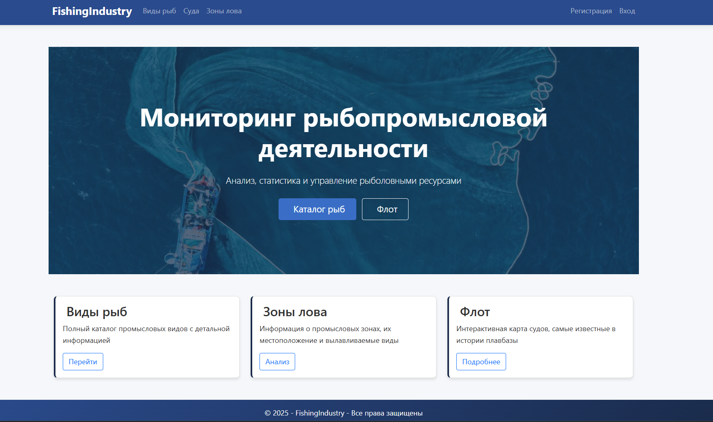
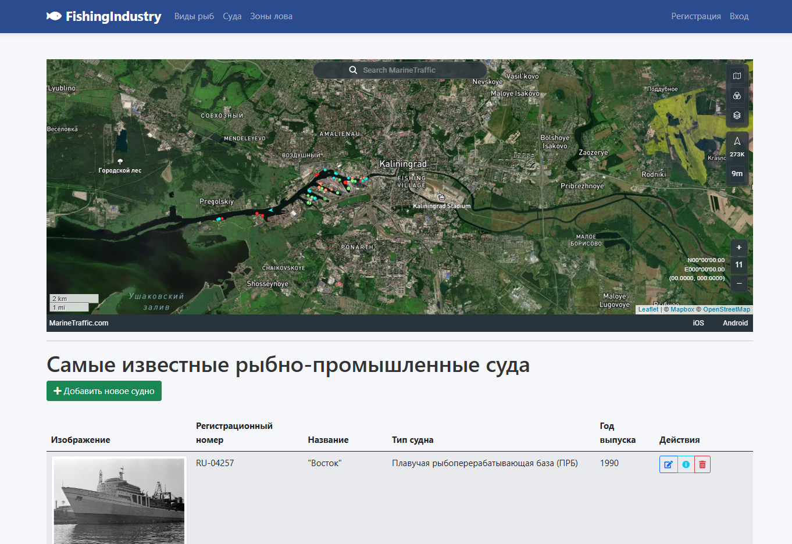
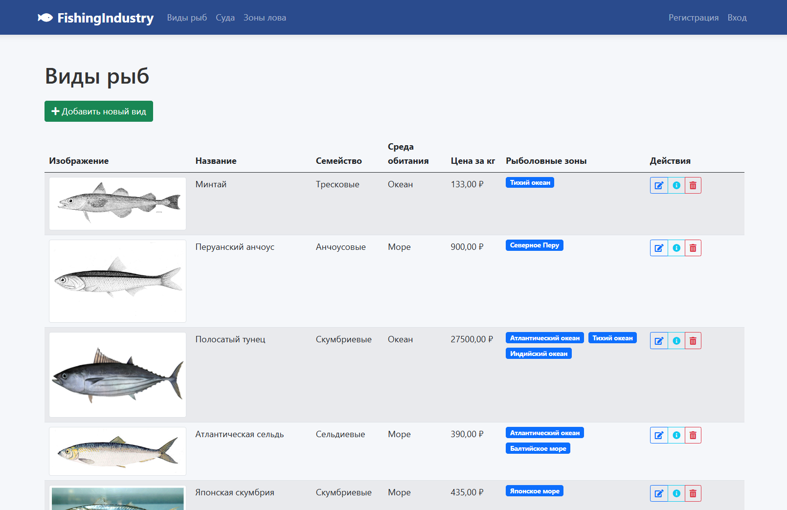
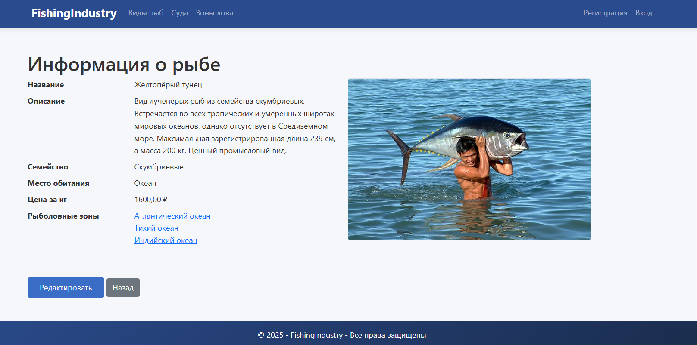
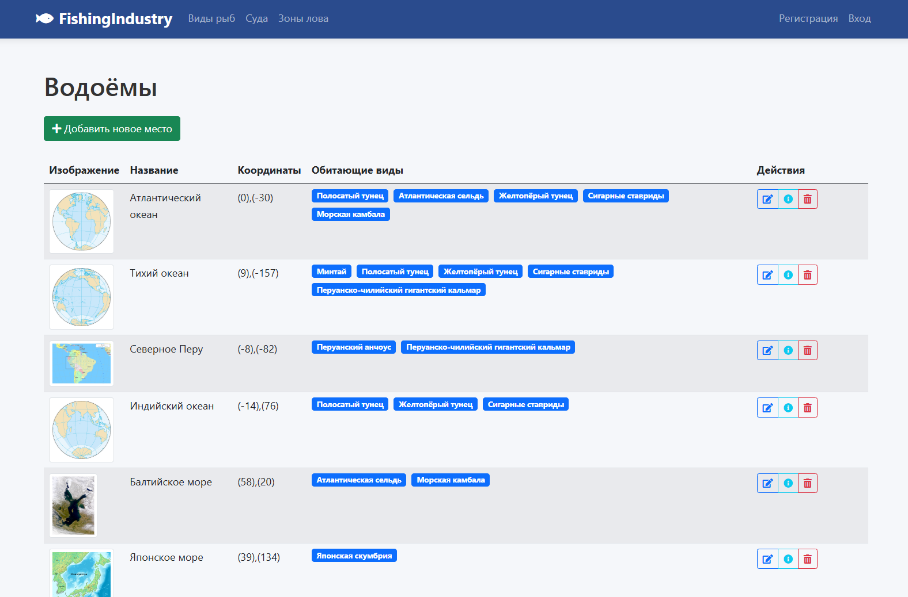

# 🐟 FishingIndustry — Программный модуль "Промышленное рыболовство"

## 📘 Описание проекта

**FishingIndustry** — это веб-приложение, разработанное на **ASP.NET Core MVC** с использованием **Entity Framework Core** и **MS SQL Server**, предназначенное для автоматизации процессов промышленного рыболовства.  
Модуль позволяет вести учёт промысловых видов рыб, рыболовных судов и зон лова, а также управлять этими данными через удобный веб-интерфейс.







## ⚙️ Основные возможности

- 📑 Ведение каталога промысловых видов рыб (название, описание, семейство, ареал, фото, цена за кг);
- 🚢 Учёт рыболовных судов с указанием тоннажа и зоны промысла;
- 🗺️ Отображение и управление промысловыми зонами с координатами на интерактивной карте;
- 🧭 Визуальная навигация по сущностям с возможностью горизонтальной и вертикальной прокрутки;
- ✏️ CRUD-операции (создание, редактирование, удаление, просмотр) для всех сущностей;
- 🧾 Загрузка изображений и валидация данных;
- 🔍 Фильтрация и поиск по видам и зонам;
- 🌐 Интерактивная карта с помощью библиотеки **Leaflet.js**.

---

## 🏗️ Архитектура и технологии

Приложение реализовано по шаблону **MVC (Model-View-Controller)**.  
Каждый слой выполняет свою роль в архитектуре проекта.

### 🔹 Используемые технологии:

| Компонент | Технология / Библиотека |
|------------|--------------------------|
| Язык разработки | C# (.NET 8.0) |
| Фреймворк | ASP.NET Core MVC |
| ORM | Entity Framework Core |
| База данных | Microsoft SQL Server |
| Интерфейс | Razor Pages, Bootstrap 5, CSS |
| Карты | Leaflet.js |
| Скрипты | jQuery, JavaScript |
| IDE | Visual Studio / Rider |

---

## ▶️ Установка и запуск

1. Клонируйте репозиторий:

```bash
git clone https://github.com/De-metra/FishingIndustry.git
cd FishingIndustry
```

2. Настройка базы данных:

В файле appsettings.json укажите строку подключения:
```json
"ConnectionStrings": {
    "DefaultConnection": "Server=(localdb)\\mssqllocaldb;Database=FishingIndustryDB;Trusted_Connection=True;"
}
```

3. Примените миграции:

```bash
dotnet ef database update
```

4. Запуск проекта:

```bash
dotnet run
```

## 👨‍💻 Автор

**De-metra**  
[](mailto:dariadunbrovskay@gmail.com)
[](https://github.com/De-metra)
